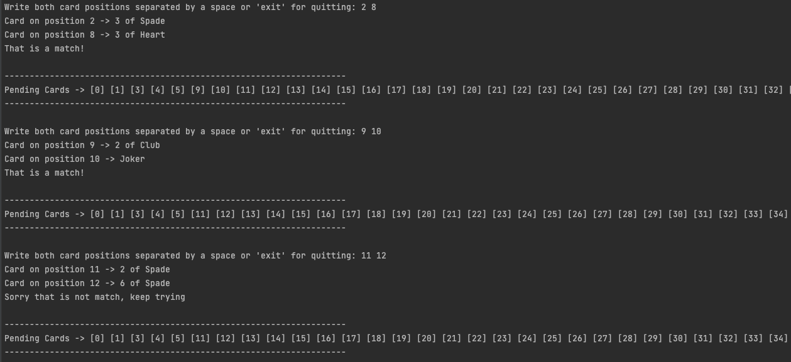

# Pelmanism code test from David Espinosa for Lendis

This projects provides a command line application for playing the Pelmanism 'Pairs' Deck game.

Build project (fetch dependencies and transpile):
```
npm run build
```
Run the command line application:
```
npm run start
```

The application will ask you for an entry command which should have the following syntax: 
"_[Card 1 Position] [Card 2 position]_", please notice the space between both numbers. 
After that press _enter_ and the application will notify you if that combination was a success match or a failure, 
together a representation of the pending cards to match in the deck.

## Screenshot

